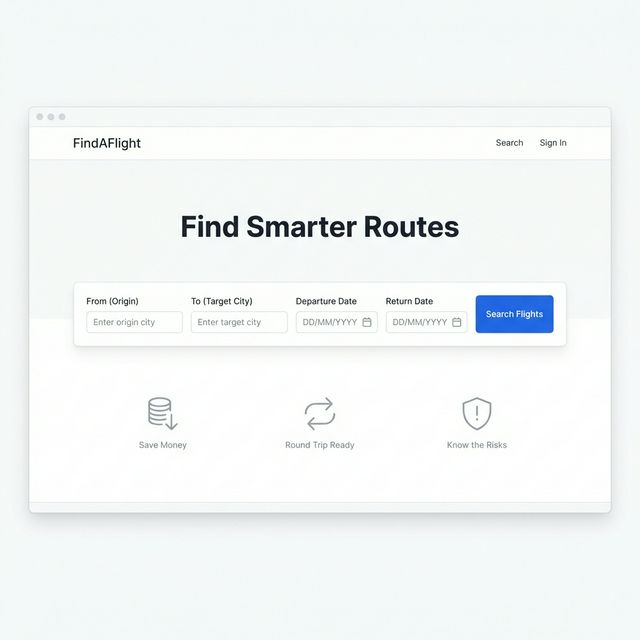
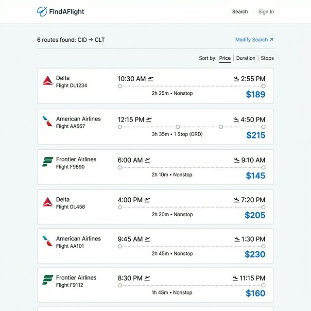
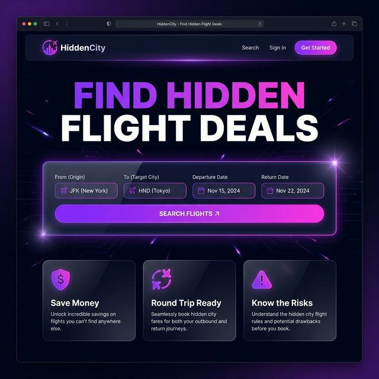
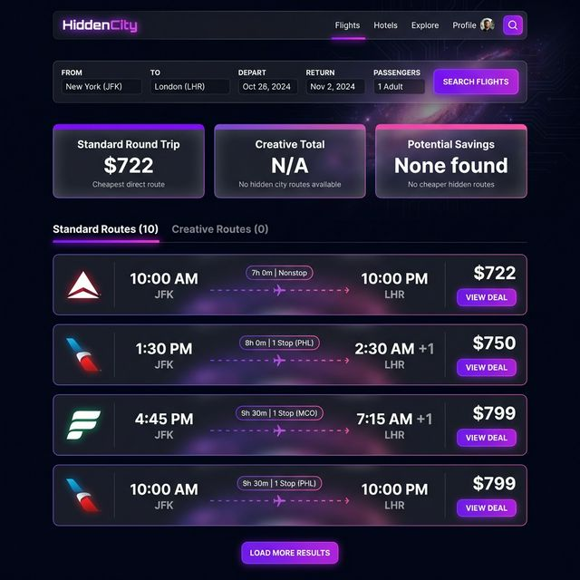
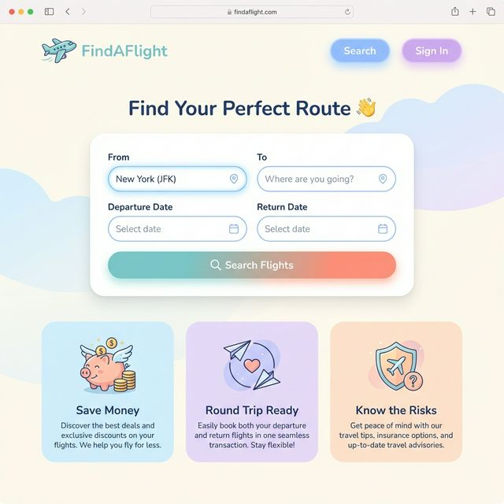
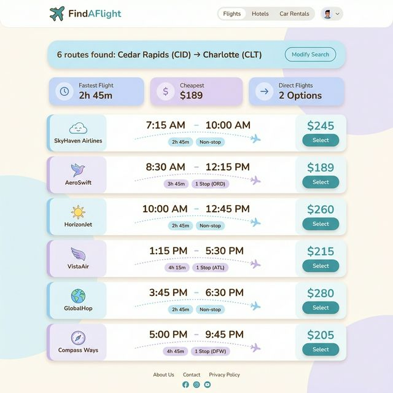

# FindAFlight — UI Directions: Evaluate & Choose

---

## Option A: Clean, Minimal, Productivity-Focused

### Home / Search Screen

### Results Screen

### Design Intent

- **Typography-first hierarchy.** Uses a single sans-serif typeface (Inter or similar) at limited weights to create order through size alone — no competing visual treatments.
- **Restrained color palette.** A single accent color (blue) is reserved exclusively for interactive elements (buttons, links), making clickable targets immediately identifiable.
- **Maximum whitespace.** Generous padding and margins let the data breathe, reducing visual fatigue during comparison-heavy tasks like reviewing flight options.
- **Flat, borderless components.** Cards and form elements rely on subtle gray borders or background tints rather than shadows or gradients, keeping the interface quiet and utilitarian.
- **Data density over decoration.** The results page prioritizes scannable information (price, time, stops) without visual embellishments that would compete for attention.
- **No dark mode.** A bright, neutral background signals a professional, tool-like context similar to Google Flights or spreadsheet software.
- **Grid-aligned layout.** Strict adherence to a column grid creates strong vertical alignment, making the page feel organized and trustworthy.

### Evaluation

**Strengths:** Option A excels at usability for its core task. The primary action — entering search parameters and clicking "Search Flights" — is immediately obvious because the blue button is the only saturated element on the page. Labels are clear, concise, and positioned directly above their fields. The results layout is extremely easy to scan: each flight card follows an identical structure (airline → times → duration → price), and the consistent left-to-right visual flow means users can compare six or more options in seconds without cognitive switching. This design is an excellent product fit for budget-conscious travelers who want to quickly assess feasibility — the tool stays out of the way and lets the data speak.

**Weaknesses and Risks:** The main risk is perceived blandness. For users encountering FindAFlight for the first time, the minimal aesthetic may not create an emotional hook or differentiate it from hundreds of nearly identical flight tools. The lack of visual warmth could make the product feel impersonal, which matters for a decision-support tool where user confidence influences whether they act on the information. Additionally, the flat design with thin borders may create insufficient visual grouping on lower-resolution monitors, causing the search form fields to blur together. The absence of any loading state animation could make wait times feel longer than they are.

---

## Option B: Bold, Modern, High-Contrast

### Home / Search Screen

### Results Screen

### Design Intent

- **Dark-mode-first interface.** A deep navy-to-black background creates a premium, immersive atmosphere that reduces eye strain and immediately signals a modern, tech-forward product.
- **Purple-to-pink gradient as brand identity.** The vibrant gradient is applied selectively to the hero text, CTA button, and accent elements, creating a distinctive and memorable visual brand.
- **Glassmorphism card treatment.** Semi-transparent backgrounds with subtle border glow give cards depth without heavy shadows, creating a layered, three-dimensional feel.
- **Bold, oversized typography.** The hero heading uses extra-large font sizes and gradient coloring to create an emotional, marketing-forward first impression.
- **Neon accent system.** Bright purple and pink are used consistently for interactive affordances (buttons, active tabs, hover states), creating a clear interactive vocabulary.
- **High information contrast.** White text on dark backgrounds ensures maximum readability for critical data like prices and flight times.
- **Summary dashboard cards.** The results page leads with at-a-glance comparison metrics (Standard vs. Creative pricing) before showing individual flights, supporting rapid decision-making.

### Evaluation

**Strengths:** Option B makes the strongest first impression of the three directions. The bold gradient typography and dark glassmorphism design immediately communicate that this is not a generic tool — it is a specialized, curated experience. The primary CTA (Search Flights) is a full-width gradient button that is impossible to miss. The results page smartly leads with summary comparison cards (Standard Round Trip vs. Creative Total vs. Potential Savings) before listing individual flights, giving users the key decision data upfront. This layout matches the mental model of someone asking "is this trip feasible?" — the top-level answer comes first, then the supporting details. The high-contrast color palette ensures prices and flight times are extremely readable even at a glance.

**Weaknesses and Risks:** The most significant risk is accessibility. Dark backgrounds with vibrant gradient accents can be challenging for users with color vision deficiencies or photosensitivity; the purple-on-dark-blue combinations may not meet WCAG AA contrast ratios in all cases. The glassmorphism card treatment, while visually appealing, can reduce contrast between the card surface and its container, potentially making the overall layout harder to parse for users scanning quickly. The bold, marketing-heavy hero section takes up significant vertical real estate above the search form, meaning users on smaller screens may need to scroll before interacting with the core functionality. There's also a risk that the "premium" aesthetic sets expectations for a polished end-to-end booking experience, which may create friction when users discover that FindAFlight is a research tool that doesn't actually handle bookings.

---

## Option C: Friendly, Soft, Approachable

### Home / Search Screen

### Results Screen

### Design Intent

- **Pastel color system.** Soft blues, lavenders, and peach tones create a warm, non-intimidating palette that feels welcoming to casual or first-time travelers who may be unfamiliar with flight search tools.
- **Generous border radius.** All components use 12–16px border radius, giving the interface a soft, approachable personality that reduces the "tool" feeling and feels more like a consumer app.
- **Illustrated iconography.** Feature cards use playful illustration-style icons (piggy bank, globe, shield) instead of abstract vector icons, making the value propositions immediately intuitive.
- **Soft shadow depth.** Light drop shadows replace hard borders, creating a gentle sense of depth that makes cards feel "lifted" without creating visual noise.
- **Friendly micro-copy.** The heading "Find Your Perfect Route 👋" uses casual language and an emoji to set a conversational, reassuring tone.
- **Pastel-coded categories.** Each feature card gets its own distinct pastel background (blue, lavender, peach), creating visual variety while maintaining harmony.
- **Rounded pill elements.** Buttons and navigation items use pill-shaped (fully rounded) corners, reinforcing the soft, approachable personality throughout the interface.

### Evaluation

**Strengths:** Option C is the most emotionally accessible of the three directions. The pastel palette and rounded design language lower the perceived complexity of flight searching, which is valuable for the target user — someone who may be unfamiliar with hidden-city routing or alternative flight strategies and might feel overwhelmed by a data-heavy interface. The friendly illustrations on the feature cards communicate the product's value propositions without requiring users to read accompanying text, which improves comprehension speed. Labels are clear and visible, and the search form's generous spacing makes it easy to fill out without accidentally tapping adjacent fields. The results page uses left-bordered accent strips on each flight card, creating subtle visual grouping that aids scanning even in a long list.

**Weaknesses and Risks:** The primary risk is credibility. A pastel, illustration-heavy design may undermine trust for users making financial decisions about travel — flight pricing is inherently a "serious money" context, and an interface that looks too playful could make users question the accuracy or reliability of the data. The soft color palette also creates a narrower range of contrast, which means that key data points like prices and flight times may not "pop" with the same urgency as in Options A or B. The generous padding and rounded elements, while inviting, consume significantly more vertical space per card, meaning users see fewer results above the fold and must scroll more to compare options — this directly impacts the product's core use case of rapid route comparison. Screen density will be notably lower compared to the other options.

---

# Chosen Option

## I am choosing to use Option B for my application.

Option B best fits the product's unique positioning as a specialized, hidden-city flight deal finder. The dark, premium aesthetic immediately signals to users that this isn't a generic flight aggregator — it's a curated tool that surfaces non-obvious opportunities. The high-contrast results display makes financial data (prices, savings) maximally readable, which directly supports the product's core value proposition. While Option A is more conventionally usable, it lacks the differentiation needed to stand out. Option C, while inviting, risks undermining the credibility needed for a financial decision-support tool.

---

## Vibe Coding Prompt

Below is a prompt you can give to another AI when building the application to recreate this look and feel:

---

> **Prompt:**
>
> I am building a flight search web application called "HiddenCity" (or "FindAFlight"). The application helps users discover cheaper flights by finding hidden-city routing — where the user's destination is actually a layover on a cheaper ticket. The app has the following screens: Home/Search, Search Results, Login, Signup, and Dashboard.
>
> Apply the following visual design system consistently across all screens:
>
> **Color Palette:**
> - Background: Deep navy-to-dark-blue gradient (#0F0F1A to #1A1A2E)
> - Primary accent: Purple-to-pink gradient (from #9333EA / purple-600 to #EC4899 / pink-500)
> - Text primary: White (#FFFFFF)
> - Text secondary: Gray-400 (#9CA3AF)
> - Card surfaces: Semi-transparent white at 5% opacity (rgba(255,255,255,0.05)) with backdrop blur
> - Card borders: Semi-transparent white at 10% opacity (rgba(255,255,255,0.10))
> - Success/positive: Green (#10B981)
> - Error/warning: Red (#EF4444)
>
> **Typography:**
> - Font family: Inter or system sans-serif
> - Hero headings: 4xl–6xl, bold, with gradient text (purple-to-pink via background-clip: text)
> - Section headings: xl–2xl, semibold, white
> - Body text: base size, regular weight, gray-400
> - Prices and key data: lg–2xl, bold, white
>
> **Component Styling:**
> - All cards use glassmorphism: bg-white/5, backdrop-blur-sm, rounded-xl, border border-white/10
> - Hover states on cards: border transitions to purple-500 at 30% opacity
> - Primary buttons: full-width, bg-gradient-to-r from-purple-600 to-pink-600, rounded-lg, white text, font-semibold
> - Button hover: gradient darkens slightly (from-purple-700 to-pink-700)
> - Input fields: dark background (bg-white/10), rounded-lg, white text, placeholder in gray-500
> - Navigation bar: dark with subtle bottom border, logo uses purple-to-pink gradient icon
>
> **Layout:**
> - Max width container: 6xl (1152px), centered with auto margins
> - Generous padding: px-4, py-8 on mobile, py-12 on desktop
> - Feature cards in a 3-column grid on desktop, single column on mobile
> - Flight result cards stack vertically with consistent spacing (space-y-4)
>
> **Animations:**
> - Fade-in on page load for hero content
> - Slide-up animation for search form and results
> - Smooth transitions (transition-all) on all interactive elements
> - Loading state: spinner with "Searching flights..." message
>
> **Key UI Patterns:**
> - Search form in a prominent glassmorphism card with Round Trip / One Way toggle
> - Results page shows 3 summary metric cards at top (Standard Price, Creative Price, Savings) before flight list
> - Flight cards show airline logo, departure/arrival times, route visualization with dotted line, duration badge, and bold price
> - Tab navigation between "Standard Routes" and "Creative Routes"
> - "Sign in to save" prompt below results for unauthenticated users
> - Login/Signup pages use centered glassmorphism cards with gradient buttons and Google OAuth option
>
> The overall feel should be premium, modern, and immersive — like a specialized fintech or travel-tech tool, not a generic booking site. Think dark-mode Stripe Dashboard meets a high-end travel experience.

---

*Use this prompt when starting development or handing off to another designer/developer to ensure consistent visual treatment across all screens.*
