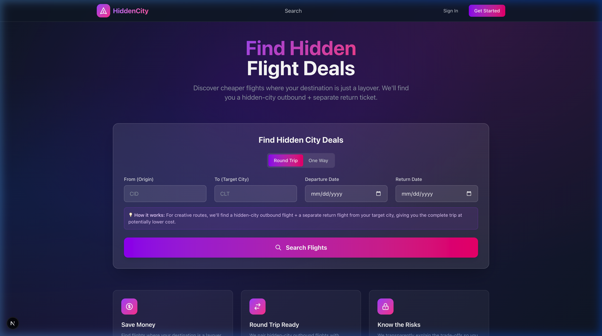
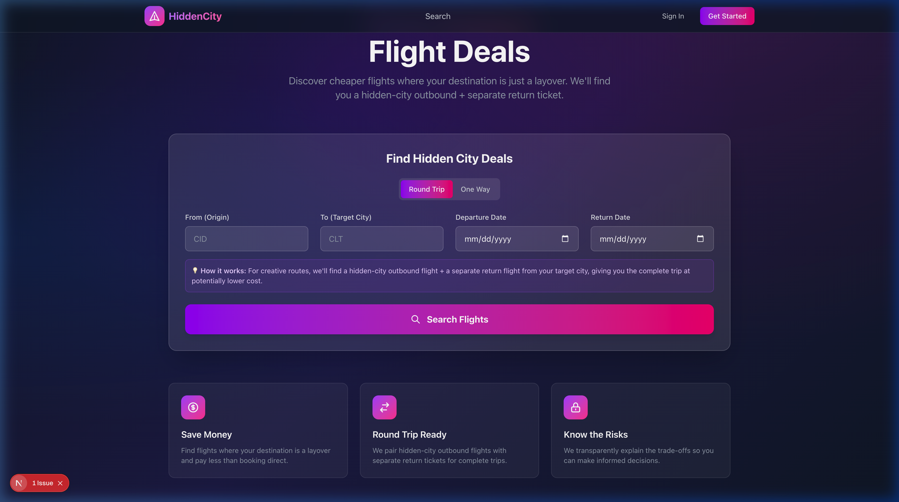
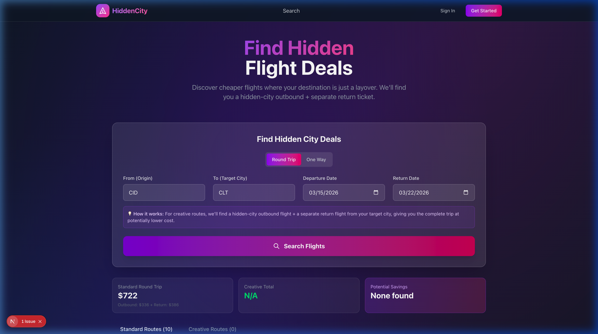
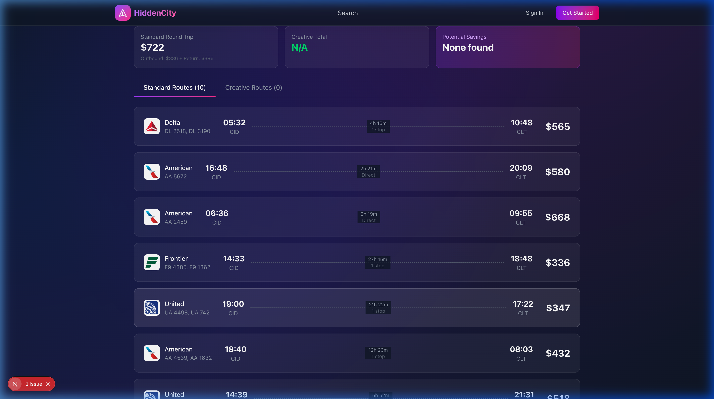
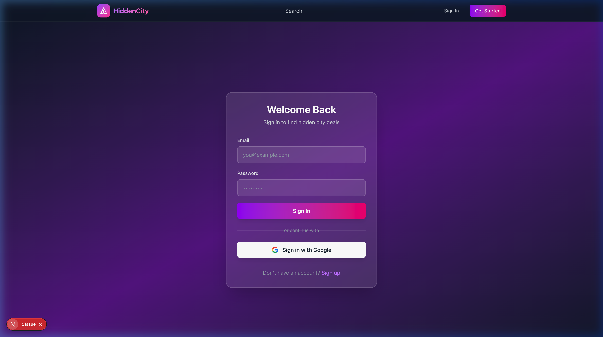
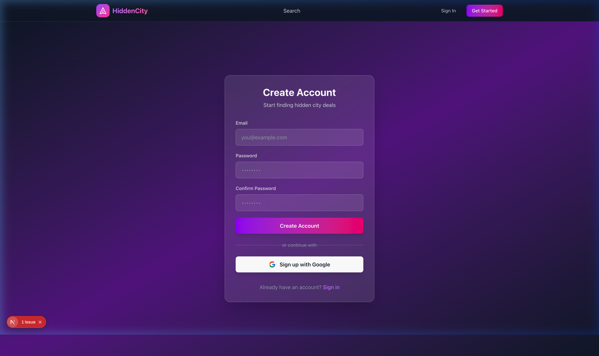

# FindAFlight — UI Screenshots

All screens captured from the live application.

---

## Screen 1: Home / Search (Initial State)

The landing page with hero section, search form (Round Trip / One Way toggle, Origin, Target City, Departure Date, Return Date), and the "Search Flights" call-to-action button.

---

## Screen 2: Home / Search — Feature Cards (Scrolled)

Below the search form, three feature highlight cards are displayed: **Save Money**, **Round Trip Ready**, and **Know the Risks**.

---

## Screen 3: Search Results — Summary Cards

After performing a search (CID → CLT), the results page shows pricing summary cards at the top: **Standard Round Trip** price, **Creative Total**, and **Potential Savings**. Tabs allow switching between Standard Routes and Creative Routes.

---

## Screen 4: Search Results — Flight Cards

The flight results list displays individual flight cards with airline branding (Delta, American, Frontier, United), departure/arrival times, duration, number of stops, and pricing.

---

## Screen 5: Login Page

The sign-in screen with email and password fields, a gradient "Sign In" button, Google OAuth option, and a link to the signup page.

---

## Screen 6: Signup / Create Account Page

The registration screen with email, password, and confirm password fields, a "Create Account" button, Google sign-up option, and a link back to the login page.

---

*Note: The Dashboard page requires authentication and redirects to the Login page when accessed without signing in.*
